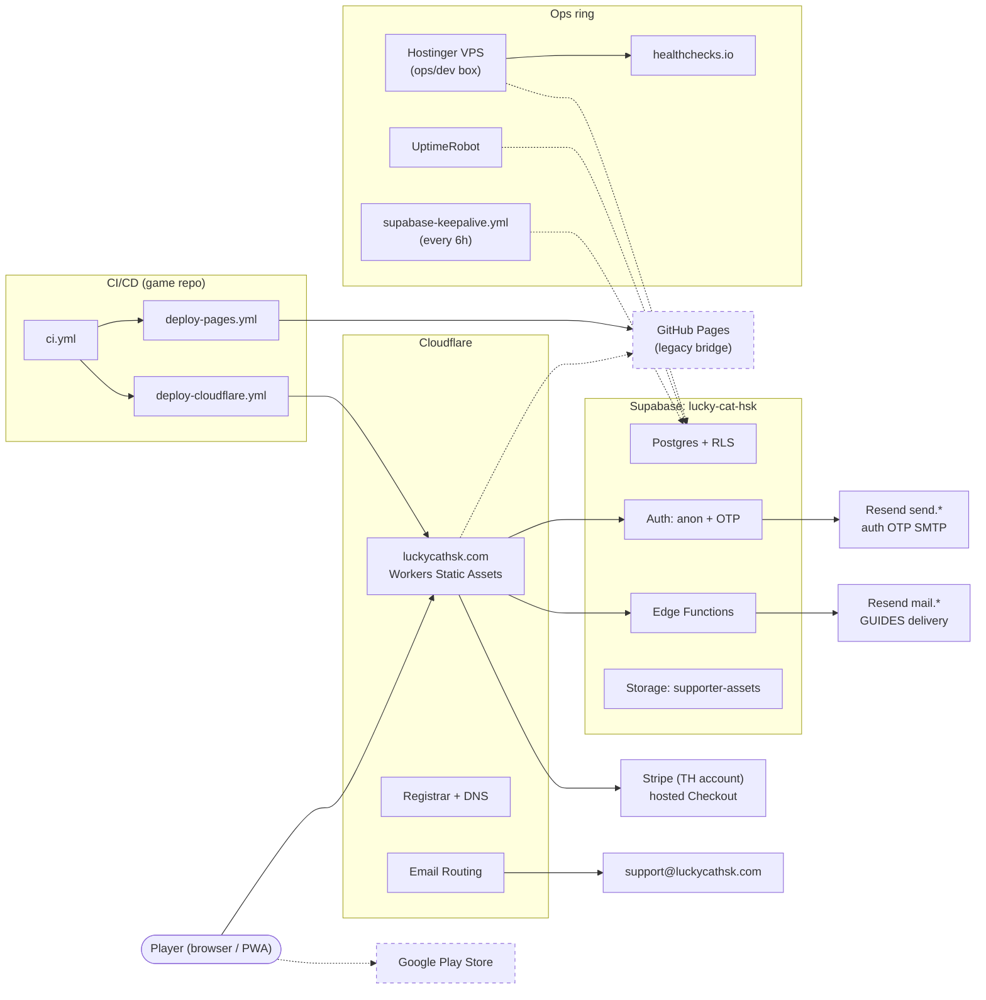
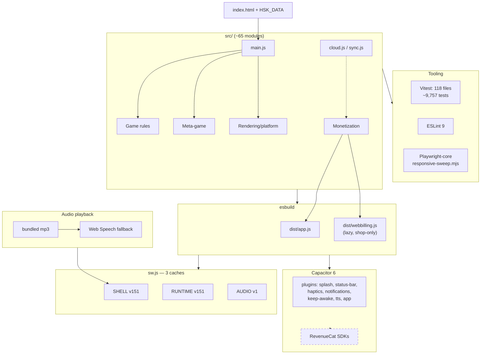
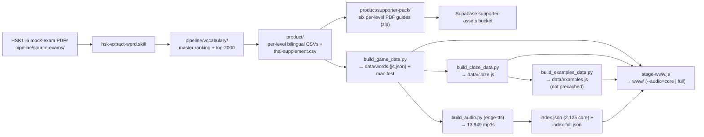
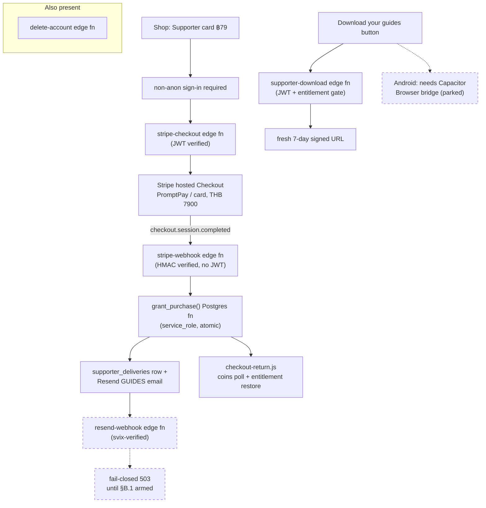

# Tech Stack — Lucky Cat HSK

Production architecture reference for the whole system: client, hosting, backend, billing,
and the ops/CI rings that keep it alive. Solid lines/boxes = live in production; dashed
lines/boxes = built or planned but not the primary path today. Solo-dev project (owner
Jordan) — this doc trades org-chart formality for "what's actually running and why."

## System context

How a browser reaches the game, the backend, and the ops/CI rings that keep it alive.

## Client tech map

What ships inside the bundle, and how the build reaches the PWA and Android.

## Data flow

How mock-exam PDFs become bundled game data.

Per-word record fields: `h`/`p`/`e`/`t`/`lv`/`f`/`ta`/`tt`/`c`/`n` (hanzi, pinyin, English,
Thai, level, frequency, tests-appeared/total, tier, introduced-flag); ~10k words cumulative
through HSK6.

## Buy & delivery flow

The ฿79 Supporter purchase path end to end.

Replays of `stripe-webhook` are idempotent — unique indexes on `grant_purchase()` make a
repeat delivery return `{"duplicate":true}` instead of double-granting (verified live with
3 replays). Delivery email idempotency key is claim-scoped:
`supporter-gift/<order>/<uuid>`.

## Reference table

| Tech | Purpose | Where it lives |
|---|---|---|
| esbuild (two-bundle build) | app.js + webbilling.js | `game/scripts/build.mjs` |
| Vitest (~9.8k tests, deploy gate) | unit/asset/precache coverage | `game/test/` |
| ESLint 9 | lint gate | game repo |
| Playwright-core (responsive/QA sweeps) | screenshot QA | `game/scripts/responsive-sweep.mjs` |
| Capacitor 6 + plugins (Android wrapper) | native app shell | `game/android/` |
| edge-tts (Python, mp3 TTS gen) | word audio generation | `game/build_audio.py` |
| Cloudflare Workers Static Assets (prod hosting, free unmetered) | prod hosting | `game/wrangler.jsonc` |
| Cloudflare Registrar + DNS + Email Routing (domain, DMARC `p=none`, support@ inbox) | domain + inbound mail | Cloudflare dashboard |
| GitHub Pages (legacy bridge origin) | secondary hosting, retiring | `deploy-pages.yml` |
| GitHub Actions ×4 (ci, deploy-pages, deploy-cloudflare, supabase-keepalive [root repo]) | CI/CD + keep-alive | `.github/workflows/` |
| Supabase (Postgres+RLS, anon+OTP auth, edge functions, storage; server of record for entitlements) | backend | project `eqsodiufgjecoqgxdisn` |
| Stripe (hosted Checkout, PromptPay+card, TH account; `STRIPE_CHECKOUT_URL` in `stripe-config.js` is the go-live/kill switch) | payments | Supabase edge fns + dashboard |
| Resend `send.*` (auth OTP SMTP) / Resend `mail.*` (guide delivery + delivery webhook) | transactional email | two accounts |
| healthchecks.io | backup dead-man switch | — |
| UptimeRobot | 5-min uptime + keep-alive | — |
| Hostinger VPS (ops box: secrets, backup cron, restore rehearsal, Playwright harness — NOT an app server) | ops | home base |
| RevenueCat SDKs (dashed/dormant — native IAP for Play beat) | future native billing | `src/monetization/` |

## Footnotes

- `rc-webhook` edge fn exists in-repo but was never deployed (web billing went direct-Stripe).
- Supabase-native analytics migration drafted but DO-NOT-APPLY (privacy-policy gate) — analytics dark.
- Supabase migrations live at `game/docs/supabase/migrations/` (applied manually via Management API, not supabase CLI).
- Free-tier→Pro tripwires: ~15+ sales/mo, any pause incident, DB→500MB, MAU→50k.
- PWA cache busting: bump SHELL version in `sw.js` on user-facing changes.
